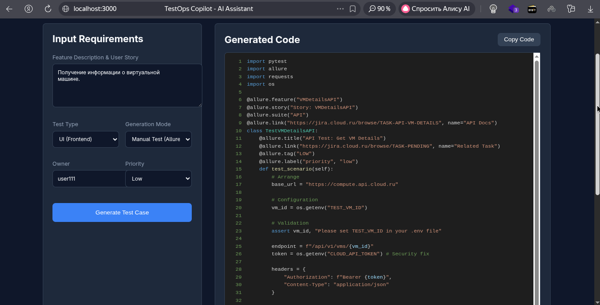

# TestOps Copilot (Hackathon Edition)

## Команда: Ezdel

**Интеллектуальный помощник для генерации автотестов Cloud.ru Compute API**

TestOps Copilot — это инструмент на базе AI (Mock/LLM), который автоматически превращает текстовые требования и документацию в готовый код автотестов (Python + Pytest + Allure). Решение поддерживает генерацию как ручных тестов (UI), так и автоматизированных API-тестов.

---

## 🚀 Основные Возможности

*   **Hybrid AI Generation:** Анализ требований на естественном языке и генерация валидного Python-кода.
*   **Context Awareness:** Автоматическое определение типа теста (UI vs API) и контекста (ВМ, Диски, Флейворы).
*   **Best Practices:** Генерация кода с учетом паттернов AAA, Type Hinting и декораторов Allure.
*   **Dynamic Testing:** Поддержка переменных окружения для запуска тестов в разных средах.

---

## 🛠 Предварительные требования

Для запуска проекта вам потребуется:
*   **Docker** и **Docker Compose**
*   Доступ к **Compute API** (токен)

---

## 📦 Установка и Настройка

### 1. Клонирование репозитория
```bash
git clone git@github.com:mutsolgov/TestOps_Copilot.git
cd TestOps_Copilot
```

### 2. Настройка переменных окружения
Создайте файл `.env` в корне проекта. Вы можете использовать пример из конфигурации или создать новый.

```bash
touch .env
```

**Пример содержимого `.env`:**

```ini
# --- Backend Configuration ---
# API Token для доступа к Cloud.ru Compute API
CLOUD_API_TOKEN=ваш_токен_здесь

# --- Test Data (Variables) ---
# ID проекта в облаке
TEST_PROJECT_ID=ваше_project_id

# ID существующей ВМ для тестов (Get Details, Update, Delete)
TEST_VM_ID=uuid-виртуальной-машины

# ID диска для тестов Disks API (List, Get, etc.)
TEST_DISK_ID=uuid-диска

# ID диска ДЛЯ УДАЛЕНИЯ ВМ (чтобы не конфликтовать с TEST_DISK_ID)
TEST_DISK_VM_ID=uuid-диска-который-удаляется-вместе-с-вм

# ID флейвора для тестов Flavors API
TEST_FLAVOR_ID=uuid-флейвора

# IP адреса для создания/удаления (опционально)
TEST_EXTERNAL_IPS=1.2.3.4,5.6.7.8

TEST_SSH_PUBLIC_KEY="ssh-ed25519 NX muhammad@222"


# --- AI Configuration ---
# Провайдер AI: "mock" (для демо) или "openai"
AI_PROVIDER=mock
# OPENAI_API_KEY=sk-... (если используется openai)
```

---

## ▶️ Запуск приложения

Мы используем Docker Compose для оркестрации сервисов (Backend + Frontend).

```bash
docker-compose up --build
```

После успешного запуска доступны следующие интерфейсы:
*   **Frontend (UI):** [http://localhost:3000](http://localhost:3000) — основной интерфейс генератора.
*   **Backend (API Docs):** [http://localhost:8000/docs](http://localhost:8000/docs) — Swagger документация бэкенда.

---

## 📖 Примеры Использования

### Кейс 1: Генерация UI Теста (Калькулятор)
1.  Откройте Frontend.
2.  В поле ввода вставьте требования на русском языке:
    > "Отображение главной страницы. Кнопка 'Добавить сервис' должна быть доступна."
3.  Нажмите **Generate**.
4.  Агент распознает UI-контекст и сгенерирует класс `TestPriceCalculatorUI` с шагами `allure.step` и `pass`.

### Кейс 2: Генерация API Теста (Список ВМ)
1.  В поле ввода вставьте фрагмент документации API:
    > "Получение списка виртуальных машин. GET /api/v1/vms. Response 200 items, total."
2.  Нажмите **Generate**.
3.  Агент распознает API-контекст и сгенерирует класс `TestVirtualMachinesAPI` с использованием `requests`, `os.getenv` и валидацией JSON-схемы.

---

## 🔍 Структура Проекта

*   `/backend` — FastAPI приложение, логика генерации (`adapters/ai_client.py`).
*   `/frontend` — React приложение (интерфейс чата).
*   `TESTING_GUIDE.md` — Подробные сценарии для проверки (Manual QA Guide).

---




## Ресурсы и Демо

Приглашаем ознакомиться с решением и протестировать его вживую:

*   **Публичный стенд (Live Demo):** http://87.242.101.32:3000
    *   *Доступен прямо сейчас для проверки сценариев.*
*   **Видео-демонстрация:** https://drive.google.com/drive/folders/1GLpe-G653shw1JGPFxbSCMsltwQe40JT?usp=sharing
    *   *Запись демонстрации работы проекта*